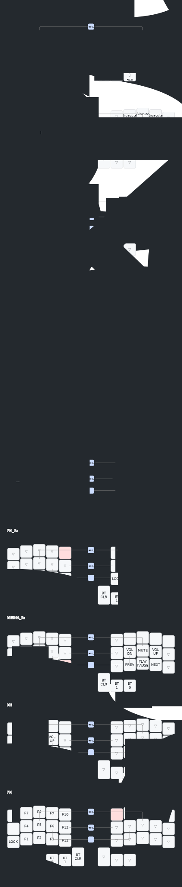

# zmk-config

This is a [ZMK](https://zmk.dev) config repo for my [chocofi](https://github.com/pashutk/chocofi), a 36 key split keyboard, arranged in 3 rows of 5 columns with 3 thumb keys on each side.

## Keymaps

Illustrations powered by [keymap-drawer](https://caksoylar.github.io/keymap-drawer?keymap_yaml=H4sIAAAAAAAC_-1Z63LaOBT-n6fQzm4RbEkTICStMzuzxpiEjWOobZIm2axrwLNluJi1TbdMlj5G36Yv0yepLMmWbHAgzYZhWvihY3_f0e3oHEnHDKypM_EFcPfPsG_27WnbsdyuADpuv93dc-33hTwImAFVU8SrRsswvfGg55ulD2WzNNtBnO16wg4AVbkWiF1wh1Rf54EnAPgWzjB0GRFyHrxDPfTczizCNIxZnYlvM9DAYE01NYZdhZjCsNaCBuvJBhu4bEYKIlZQJEPjWtIJKNcMICoGw6sMP2nVGV5juH5ar3E1TjAzmgzHVtf0pkPGnKYyf2BGq5-czjV3ljIAhasSGzFEP8KxGV7j8g0uJVxeRPoVrHwuV-sib24Vw35v0KVmPGc95CFe4WOm_YIsuQAZtIehP7mB3UCuK872hlhJmaTeFCXiNBf1cwZXROkshZJVQ9ZS7QxvYcyzsJcwx_3y6XMe-NOxjSbuWiNvtoSBGRu3AKke5t_Zg-7sEU1OuCZhphd7c2LdpbdhraS3ZbbM-phglxYe1SoKt6ARGNKPi7R7YxD3E4Yg_-Kwl3sDcBW1LbNl1sfgo1z4LqeMwtL2VghKbIIwki0nelpe-XtjFDEr5R7RbmL_hR9_LAOyuyUJKPgTmf9fuPyFYHfUv2ZU_krlEZUvqXxF5HN2zv0OF6Uo8D8Kx6_7GYrGLs5ZgumnfCqRS9yL58_RPdbsAUzPSWCZJ2Mdw0OYmpjszuUl8Bm1wc8JG91QeUvlPpUFKotUlqj8jcq3RJpL1rUqK7IhL1E6RiXKLegKh5vF-97Q_NdxuzCMIzxTEkuKnlVOste5HF9FajSvCBtQtPsat34j-4NvDnoj27RHvu2S3ApmxigH7zkTj6fIwJqiTgePPYQORDHIA02i2AtePG70f8OIY2lu41JNX-9WE4ia1rhMW3QMLVp2CBcNg7N-ZNa-j7VMrBXZNoBixkyITN-emq49ti0_RiBTs6oP2MdwYi1mo_wyh9cCIWTIuVX2C9Q3cQlcV1arARUknOs-e5N7dMabeshYnk1tVTsi4iURr4go7G_Mod52HH_gWF3k-GRsB0SUiTikAy5sypnakM7okIgoElGiYPEJ-qwYQFK08LEQPgRrSL_obP6Nr4LDRZV1He0MUhISW0YjidVViY_2TZ7cRUMBVZV8QGvRTS_AWs2NGfrKuXRTk8lnw6YiXqFTqKWT-ajyG2O9HrPM6xVh63Mb7XMPZzbG-b6VCRx0_sbN-2_o0_9n38H_JULaeXr_BeBJv7Hdd-4n7ymLj_3iD3zsf-Omub8Gl-s4w7bjCTu7YCyAm0IxDwpHt0i_j7_feh0Tp3IWevOdcfDoCGD_RTnUP0T6pUi_Y429KNsK6rQd33eG89UOULVyspuvy4Gg0uIcAAA%3D)

### layout

