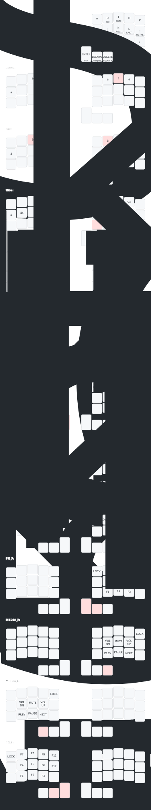
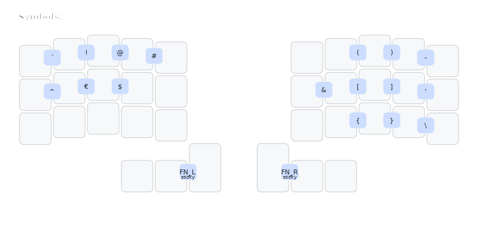
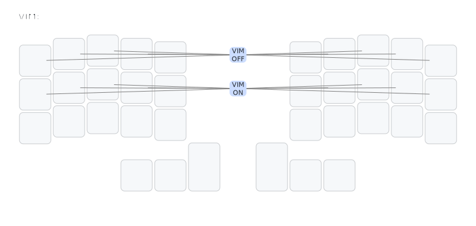
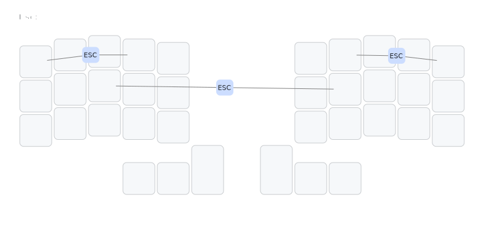
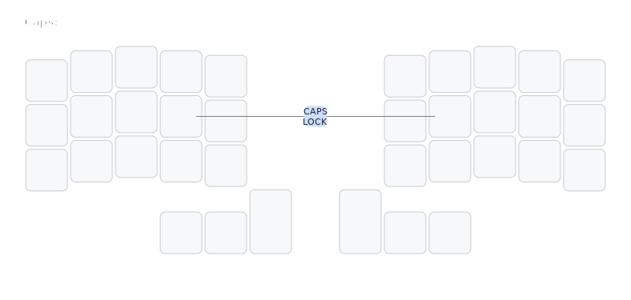

# zmk-config

This is a [ZMK](https://zmk.dev) config repo for my [chocofi](https://github.com/pashutk/chocofi), a 36 key split keyboard, arranged in 3 rows of 5 columns with 3 thumb keys on each side.

## Keymaps

Illustrations powered by [keymap-drawer](https://caksoylar.github.io/keymap-drawer?keymap_yaml=H4sIAAAAAAAC_-1afXLaRhT_36fYTFILEjmxJBtsdTITWUg2tQwECTeJm6gyaGIKWBRwUsZDj9Hb9DI9Sd5-aSWiUBI3ttKIGfatfu9zn_ZJuwvDYB5dzXR0_fto4A_C-XkUTHo66k4G570nk_CdIiPMGTIxx3jZ7Hj-dDzsz3ztj11fW2wAL5xM9Q2EapaNyRZ6TtqfSXsNapaMLsBof9JdxFibYEH3ahZS0CPty1igk6FUX1ZqkrYVCxhEwDG9tiO0XAoajiewGsUOO3WB2RRzj-yE4CEBL69G46An0COCTuej82g4FfBPBG6nLRxTMOXKoVgqpB8pJmJ_RdoXpDVJe0rag1ilQVRm_WGP5eOEtJIsEfqYtE9i8QPDPHZbhknvx4lVqxt-Ik-ecZA9LKFzWj8RsNXwrHYG7JpGy8pMW81yLC_pvY155H7qsdA_f_0to9l8HMLIJsFlIo5sjrQZEgsSkyP8i3DYW9zA5FXCpLTZT11FKXefthGsJVdwCs7tcfDzVL-RVSg3bETi7JtV2soaJH54CSYvInGxsgDXESs4Bef2OORdrf8vhwxlGU7XKEqSAl7JQVTU59fiLD2epT-_r1TTxWdeak16yKZ8ldE9RvcpfXS3k4NuEqQdFtQuoxVGt_IydaRtFpHCqMqoJiJ8LKOpjjdBtxza09VJYtsqOiGleyzuZ4zep_QBvfohL_l-w57TUmoSl0hb_u82XF-UbzYped4dt6TSkKQzxnldvFz-jQNbdzYj-Sv5XX_kv48mPZZVo9SuHx555ZQQ4x2WzDLvvaK9mmUvHxDgYiRWm6wiQfo0Lc0MQjA-PSP4OKS3UkYEq0jCENbvXgSXb0NmcDBDjmV7vntUt71VpjYH4dyfhOMwmGXxP51vkYevWB5iXDo6k2BLRlPVfY-7X_Kl6hei-5voDkR3mK3X_dgkBInWcP2azkR281OD6eHBwCykrPLnDypx6sUsikH18KD4qVSWMjiO9cvrjiY5Krvht_OyBnGa5jHp2FVK9ijZp0RRcv8Us3co2aWkwgJX8x84za1NI7W1u13trf1QYqe0-d-wHpCXVMNyXShncxkyOl5zGas3zHRR5Hl4p00H1Rr0iL_DXmoY67S-4SVJq23RHzRaRselY2pYL7xvbWfNfkfRixlazNC8nv3cdUiwCmIFUqxBvtc1SD5WNJ_P6Uaj82iqb2yhMWxMlD0ZKVW8sh_o5ICBwVWAKxw-4zCgHCwxCPS5eplBKoipsfI1V1ZBVI1dLTi8L6M9Dj6VhNV9Dm7FQYGoEsvChxsGXOX4L1y4AsK7XHiTy24DysFfY8Ogz8F7sVUZaRx8xkFNRjscvB-rY6Pc6hsOgr7CDTzgIHhSuCvHLcF2TC2XhUPsEyRktM1k6J8PEtmHZInUpLg0CmwfO8a3D99Z-CazBpvSRCK4Q5Cspgzj3T6zqiUmAnhzyQMvMcRKViwaaGk8UeS_KLBtpH_GmPW7g_mCy0EImpqWc1JyHwCKLUV30iMAAA%3D%3D)

### Base layout

### Combos

