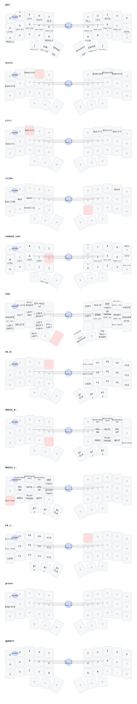

# zmk-config

This is a [ZMK](https://zmk.dev) config repo for my [chocofi](https://github.com/pashutk/chocofi), a 36 key split keyboard, arranged in 3 rows of 5 columns with 3 thumb keys on each side.

## Keymaps

Illustrations powered by [keymap-drawer](https://caksoylar.github.io/keymap-drawer?keymap_yaml=H4sIAAAAAAAC_-1a71LjNhD_zlO40za6HrmD8PfOnc7UcRzIYeLgOOSAUp9JXMjgxKntcJeh6WP0bfoyfZLKu3IkOxgyw8GkNHyQ4v2tpNV6V9pd4zljfxTJ0u3v_Wv72h1f-E7QlaVOcH3RXQvcm1JR8oDFHjh9V5Z05cRoWXY49HqRvfll296crFAGNwjlFUmqaNW4eyPd0imPilIoS-QTmUxJbSC1OUErSld0tV7Q4TQTaE5nFLmcaAGxWrdNTjtJaDqnte6YsJad0IC2MWVQgEFXLVOYqYlErWpJim5xeoXT91o1Tq9yenO_VhVG7AEyGPWHTtcOx32O7OciHwAxa3v7M9MdCFBKAl0AUiIT-odYvMXZ13IK4KFWqSmJLj9Cq0J7PGUsC4zCi6gDOep5XabgQ750kcB6P3LutyiALAiwBqRfBInPUOC9UW9V8aLVzLuxlHLOW2g2FBWN6rh2yMllRT3IgbS6pZm574GcpwTZC1bNRBQwKG7u__z1d1GKxkPqJFHgDMLJAwgpuDADYXyAX7led_KIKUfClKTQSz35qeXy53Dm4lsiS-T5kPhAlx81K3W3eBKSwI_ztHt9ENZJXFB88PnDvQ44D9sSWSLPh8DdLr_ILVO3dMM5nBJUkHiy409_PTz45Wms43Z7nuc8ZuOZQ5j8-f_SIo810avIN7j_X6H9Dmm3zMgmXDfkNcbTFGOK22VM71j_njOvImvhkoZzwk34M7kr3yF_MHI6dSgwairKfoW05r6Yl_xw99WKsf0rYcotkp_ckG0RVI3DQ6VeEeAdkpvkvGGaKXjT7ZLvmVK-Zf1r1p-x_lzQ7Dobf5YMLjGmDdZvCsw_JYtFV72O7QSB_zkZ9omz2TlZyte1L5ZQFUEAmtswi0pOqJte3_7sB118jrMp0B48NX-LVuPU5lQcohqNE_jBEUh8NUxxI__y0nNFExm4XyLb6w1c2x1EbpCoZhi4Nz1_FIoQDmsoTUvjGVhTVRoaV5Vq1C3TYKYZmyP-YFrkD2A6ouAxlYtrtOv5dtZqSIppGu28XBpIeaYmCGxyJ8rIVNF0jW2ScIvgTDO6hDxXS-8o0xWu3bEduEPXiVJA_KJSm5_z1IXiB11WSI9DpKD081hfvDbTVhhn0-CtcaHmucOF7I1SCMchVVboMl1Vd7F7h9177ErrC3OrXvh-5PlOl7oJyraF3TZ2O0zg0oIIrBvqARMJuw3sNhlx4wnWLNPTQTd5WQe9iJ7UkxnaOtBYrWrxQ9cy-FBdazbpyaFmSUrLMrK0Wl3Nni6LurljQ5cqdSwNttihGNNajYURfe6iQMPUsCDa0JUTepO1mrifuvbRynHkhfABXX4yC7wvOvgPm-Rl4Ny4C7qplJHNBt4PGumi50xpC77b0jOO8LUEiD8oyXlX8v0xxJNWFu8LHbKhzjJyeAGGCOePvKxA8hocaGRZGV8ii4MctTXTOkEvPYK2DS3et3go4JWLNZUWtLWZ_0NQsB6DpQM8BzG1h3Yf2g_Q4tGps9ifRf-nOV_ty3jtC1_lSRFHvIV2baHV2_H7F34or7yRhrJ0VtooSqXdc8p_Dd_zwo69ThJsh2KbU6zjDENW9GL4FsW37x67TiGGYGVn5V8qW9IhFiMAAA%3D%3D)

### layout

